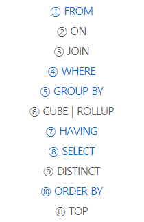

## SQL join

### ANSI JOIN
- 표준 SQL JOIN 문법 

- FROM절에 JOIN이 들어가고 ON 조건절에 기준이 되는 컬럼 조건을 작성

- Oracle DBMS 에서의 JOIN SQL 문은 WHERE 조건절에 조인 조건을 작성

- DBMS에 종속되지 않고, 가독성 측면에서 **ANSI JOIN** 문법을 따르는것을 추천한다.


### INNER JOIN
```sql
    --ANSI JOIN 문법
    SELECT t1.column_name [,t2.column_name] 
 
    FROM table_1 AS t1 

	    [INNER] JOIN table_2 AS t2 --INNER 키워드 생략 가능

	    ON  t1.column_name = t2.column_name; --ON 조건절에 조인 조건 명시


    --Oracle JOIN 문법
    SELECT t1.column_name [,t2.column_name] 
 
    FROM table_1 AS t1 , table_2 AS t2

    WHERE t1.column_name = t2.column_name; --WHERE 조건절에 조인 조건 명시
```

### OUTER JOIN
- 두 테이블이 조인을 했을시 해당 컬럼에 값이 없을때 해당 레코드는 보여주지 않는다. 

- 기본적으로 NULL 값들은 제외

- 하지만 OUTER JOIN을 통해 컬럼에 값이 없어도 반환 해준다.

- 어떤 테이블에 값을 다 반환 할지는 **LEFR JOIN** , **RIGHT JOIN** 을 이용

- 조인할 테이블에 값을 모두 반환 할때에는 **FULL OUTER JOIN** 을 사용한다.
```sql
    --ANSI JOIN 문법
    SELECT t1.column_name [,t2.column_name] 
 
    FROM table_1 AS t1 

	    LEFT/RIGHT/FULL OUTER JOIN table_2 AS t2 

	    ON  t1.column_name = t2.column_name; --ON 조건절에 조인 조건 명시


    --Oracle JOIN 문법
    SELECT t1.column_name [,t2.column_name] 
 
    FROM table_1 AS t1 , table_2 AS t2

    WHERE t1.column_name(+) = t2.column_name(+); --(+)키워드로 LEFT,RIGHT,FULL OUTER 설정
```

### *JOIN 할떄 ON 조건 , WHERE 조건*
- JOIN후 WHERE 실행 
- ON 조건절에 검색조건도 쓰게되면 기능 향상 **(불필요한 db 제거하고 보여주기 때문에)**
```sql
    --(1 SQL)
    SELECT *
    FROM TB_ACADEMY A
        JOIN TB_RACA R 
		    ON A.RACA_ID = R.RACA_ID
    WHERE NOT RACA_TYPE IN ('P')
        AND WCUBE_AMT < 150000 ;


    --(2 SQL)
    SELECT  *
    FROM  TB_ACADEMY ta 
	    JOIN TB_RACA tr 
	    ON ta.RACA_ID  = tr.RACA_ID
	    AND tr.RACA_TYPE IN ('P')
	    AND WCUBE_AMT < 150000 ;
```

### *SQL 실행작동 순서*
