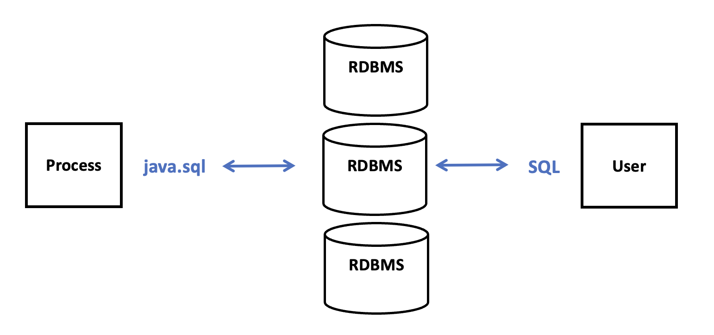
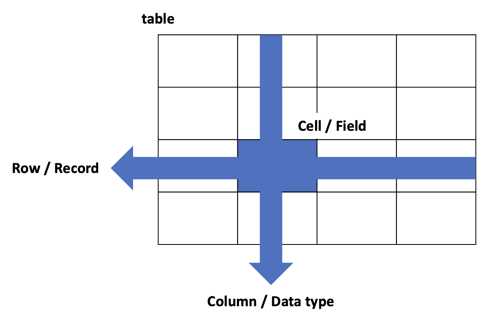
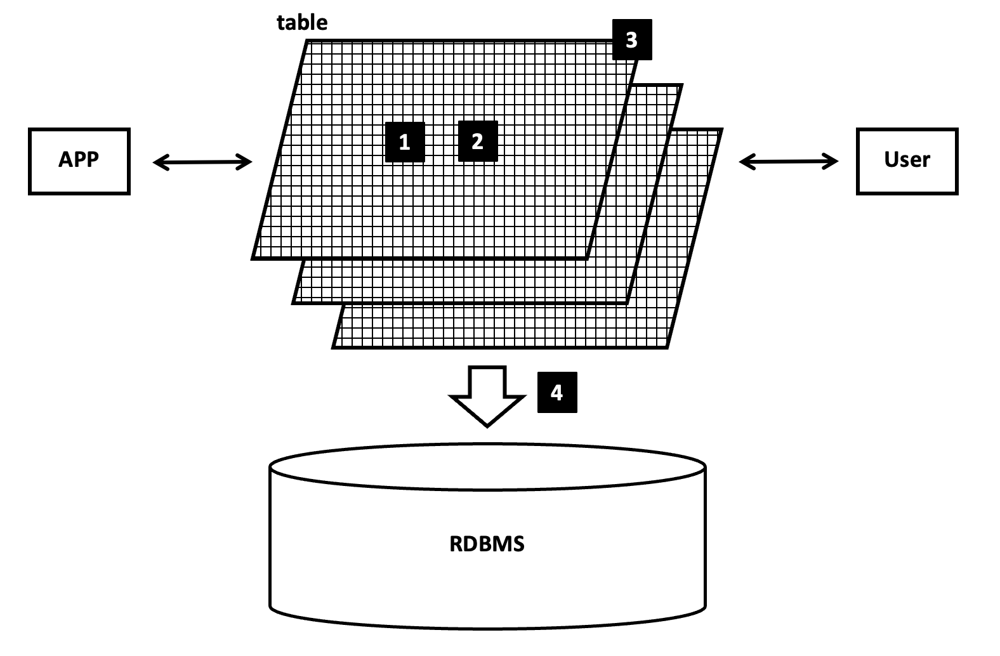

## SQL 이란?

- Structured Query Language <b>RDBMS</b> 표준 사용법  
  
- RDBMS
  - Relational Database Management System 
  - 관게형 데이터베이스를 생성하고 수정하고 관리할 수 있는 소프트웨어
    *RDBMS*

- RDB
  - Relational Database 관계형 데이터 모델
  - 데이터를 2차원의 테이블 형태로 표현
    *RDB*

- sql query 종류
  - ```sql
    c/n : column name
    t/n : table name
    -- : SQL 주석
    keyword : 대문자

    SELECT
    c/n[,c/n]
    FROM t/n[,t/n]
    [WHERE 조건[AND 조건]]
    [GROUP BY c/n[,c/n]]
    [HAVING 조건[AND 조건]]
    [ORDER BY c/n [,c/n]]
    ```
    *sql query*

  - 